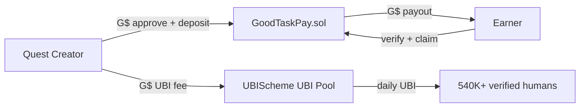
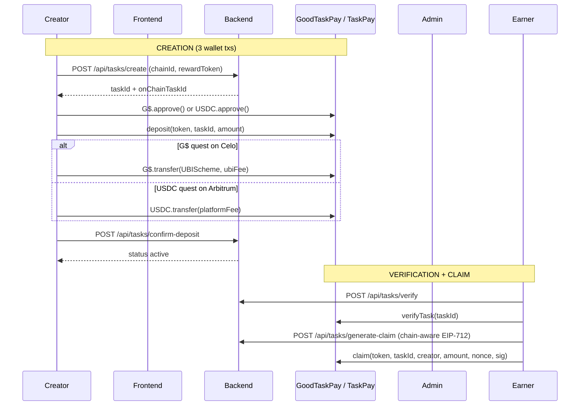
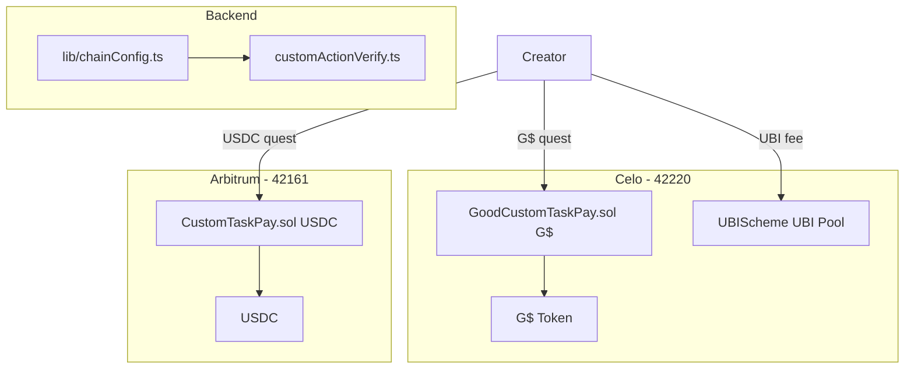

<p align="center">
  
  
  
  
  
</p>

<h1 align="center">TaskPay</h1>

<p align="center">
  <strong>The quest marketplace on Celo — rewards in G$.</strong><br/>
  Creators fund bounties in GoodDollar (G$) or USDC. Users complete verified social & on-chain actions. Everyone gets paid from smart contract escrow.
</p>

<p align="center">
  <a href="https://www.trytaskpay.com/"><strong>Website</strong></a> ·
  <a href="https://farcaster.xyz/miniapps/yfZqr7DiqHjC/taskpay"><strong>Mini App</strong></a> ·
  <a href="https://x.com/TryTaskPay"><strong>X</strong></a> ·
  <a href="https://farcaster.xyz/taskpay"><strong>Farcaster</strong></a> ·
  <a href="https://farcaster.xyz/~/channel/taskpay"><strong>Channel</strong></a> ·
  <a href="https://t.me/+saFVhCmCg1Q3YWJl"><strong>Telegram</strong></a>
</p>

---

## Overview

**TaskPay** is a quest marketplace where projects grow and users earn — paid in **GoodDollar (G$)** on Celo, with USDC on Arbitrum as a secondary option.

Creators launch quests with a G$ or USDC budget locked in on-chain escrow. Earners complete actions on **Farcaster**, **X (Twitter)**, or any **on-chain dapp** (swap, mint, stake, deposit). We verify completions automatically and release rewards via **EIP-712 signed claims**.

Available as a **full web dapp** and a **Farcaster Mini App** — same product, two entry points.

| | |
|---|---|
| **Primary chain** | Celo (G$ rewards) |
| **Secondary chain** | Arbitrum One (USDC rewards) |
| **Settlement** | G$ (18 decimals) · USDC (6 decimals) |
| **Quest types** | 10 (social + on-chain) |
| **G$ quest fee** | UBI Pool contribution (configurable, default 500 G$) |
| **USDC quest fee** | $0.25 USDC per quest created |
| **Reward commission** | 0% — 100% of budget goes to earners |
| **Min quest budget** | 1 G$ or $1 USDC |

---

## GoodDollar Integration

TaskPay is built for the **GoodDollar ecosystem** and qualifies for **GoodBuilders Season 4** by providing meaningful G$ utility:

| Integration | How TaskPay implements it |
|-------------|---------------------------|
| **Provide services using G$** | Quest rewards are paid in G$ on Celo. Earners claim G$ directly to their wallet after verified completion. |
| **UBI Pool contribution** | Every G$ quest creation sends a configurable G$ fee to [UBIScheme](https://celoscan.io/address/0x43d72Ff17701B2DA814620735C39C620Ce0ea4A1) (`0x43d72Ff17701B2DA814620735C39C620Ce0ea4A1`), funding daily UBI for 900K+ verified GoodDollar users. |
| **Celo smart contracts** | `GoodTaskPay.sol` (social quests) and `GoodCustomTaskPay.sol` (on-chain quests) — G$ escrow with EIP-712 claims, 0% platform fee on-chain. |
| **Multi-chain** | Celo + G$ is the default reward path; Arbitrum + USDC remains for existing users. |



**G$ token:** `0x62B8B11039FcfE5aB0C56E502b1C372A3d2a9c7A` (Celo mainnet, 18 decimals)

---

## Live Traction

| Metric | Value |
|--------|-------|
| Total users | 3,000+ |
| Unique earners | 1,346 |
| Quests completed | 250 |
| Rewards distributed | $1,313+ (USDC + G$) |
| On-chain transactions | 45K+ |
| Platform revenue | $62.50 |

---

## Why TaskPay

Most quest platforms pay in points, hold funds off-chain, and get gamed by bots. TaskPay is different:

- **Real money** — rewards in G$ (Celo) or USDC (Arbitrum)
- **GoodDollar aligned** — G$ quests contribute to the UBI Pool on creation
- **Non-custodial** — funds in smart contract escrow on Celo or Arbitrum
- **Verified** — Neynar/X API for social, wallet scan for on-chain
- **Anti-bot** — filter by Neynar score, followers, account age, Pro status, spam label
- **Instant claims** — EIP-712 signed payouts straight to wallet
- **Budget reclaim** — creators recover unused funds after expiry
- **Low fees** — UBI contribution on G$ quests; $0.25 flat on USDC quests

---

## Features

### For Creators
- Launch social quests on Farcaster & X — **reward in G$ (Celo) or USDC (Arbitrum)**
- Launch custom on-chain quests for any dapp action on Celo or Arbitrum
- Set targeting filters (followers, Neynar score, account age, Pro, anti-spam)
- G$ or USDC escrow — budget locked until verified completions
- G$ quests automatically fund GoodDollar UBI Pool
- Reclaim unused funds after quest expiry
- Push notifications to Farcaster users when quests go live

### For Earners
- Browse quest feed with live G$ and USDC reward pools
- Complete social or on-chain actions
- Verify & claim G$ or USDC to wallet
- Leaderboard rankings
- Free to use — zero fees

### For Dapp Builders
- Define contract address, function selector, and event to track (Celo or Arbitrum)
- TaskPay auto-verifies wallet transactions via RPC + Blockscout
- No manual admin review, no tx hash paste for users
- Separate escrow contracts per chain (`GoodCustomTaskPay` on Celo, `CustomTaskPay` on Arbitrum)

---

## Quest Types (10)

| Platform | Type | Action |
|----------|------|--------|
| **Farcaster** | `follow` | Follow a profile |
| | `boost_lite` | Like + recast a cast |
| | `boost` | Full amplify engagement |
| | `quote` | Quote a cast |
| | `channel` | Join a Farcaster channel |
| | `miniapp` | Try a mini app + optional feedback |
| | `multi` | Follow + engage bundle |
| **X (Twitter)** | `x_follow` | Follow on X |
| | `x_boost_lite` | Like + repost |
| | `x_boost` / `x_bundle` | Engage or follow + engage |
| **On-chain** | `custom_onchain` | Any smart contract action (swap, mint, stake, etc.) |

---

## How Verification Works

### Social Quests — `GoodTaskPay.sol` (Celo) / `TaskPay.sol` (Arbitrum)



### Custom On-Chain Quests

Any dapp on **Celo or Arbitrum** can reward users for a specific smart contract action. Creators register the action once with an example transaction; earners open the quest, perform the action in the partner dapp, and TaskPay **auto-scans their wallet** to verify.

**Flow:** Register action → admin approves → fund escrow (G$ or USDC) → earner opens quest → performs on-chain action → verify scans wallet → claim reward.

#### System architecture



---

## Smart Contracts

### Celo (G$ — primary)

| Contract | Address | Purpose |
|----------|---------|---------|
| **GoodTaskPay.sol** | `0x14a4495E209A62F25CCe7ec32097E103490a6179` | G$ social quest escrow — deposit, verifyTask, claim |
| **GoodCustomTaskPay.sol** | `0x880712866c174E8c90e0Bb9B4B5F1c58236B7c0A` | G$ on-chain quest escrow — deposit, claim, reclaim |
| **G$ (GoodDollar)** | [`0x62B8B11039FcfE5aB0C56E502b1C372A3d2a9c7A`](https://celoscan.io/address/0x62B8B11039FcfE5aB0C56E502b1C372A3d2a9c7A) | Reward & escrow token |
| **UBIScheme** | [`0x43d72Ff17701B2DA814620735C39C620Ce0ea4A1`](https://celoscan.io/address/0x43d72Ff17701B2DA814620735C39C620Ce0ea4A1) | UBI Pool — receives G$ quest creation fee |

### Arbitrum One (USDC — secondary)

| Contract | Address | Purpose |
|----------|---------|---------|
| **TaskPay.sol** | [`0xaFbB51Edf73390F4181492b5227E99936729d043`](https://arbiscan.io/address/0xaFbB51Edf73390F4181492b5227E99936729d043) | USDC social quest escrow |
| **CustomTaskPay.sol** | [`0x1646172573E7D2fef7C32DE6ee96A38486428202`](https://arbiscan.io/address/0x1646172573E7D2fef7C32DE6ee96A38486428202) | USDC on-chain quest escrow |
| **TaskPayChat.sol** | [`0xdf1937B71E88dE6f8CDa5fA6F5Ddfba8bFA72fea`](https://arbiscan.io/address/0xdf1937B71E88dE6f8CDa5fA6F5Ddfba8bFA72fea) | Community chat registration |
| **USDC (native)** | [`0xaf88d065e77c8cC2239327C5EDb3A432268e5831`](https://arbiscan.io/address/0xaf88d065e77c8cC2239327C5EDb3A432268e5831) | Reward & escrow token |

### Environment variables

```env
# Celo / GoodDollar
NEXT_PUBLIC_CELO_SOCIAL_ESCROW_ADDRESS=
NEXT_PUBLIC_CELO_CUSTOM_ESCROW_ADDRESS=
NEXT_PUBLIC_UBI_FEE_G_DOLLAR=500

# Arbitrum
NEXT_PUBLIC_CUSTOM_TASK_ESCROW_ADDRESS=0x1646172573E7D2fef7C32DE6ee96A38486428202
ESCROW_SIGNER_PRIVATE_KEY=   # same signer for both chains
```

Both contract families use **OpenZeppelin**, **EIP-712 typed signatures**, **ReentrancyGuard**, and **SafeERC20**. G$ quests have 0% on-chain platform fee; the UBI contribution is a separate `transfer()` to UBIScheme at quest creation.

---

## Tech Stack

| Layer | Technology |
|-------|------------|
| **Frontend** | Next.js 14, React 18, TypeScript, Tailwind CSS, Framer Motion |
| **Wallet** | wagmi, viem, ethers.js, SIWE auth (Celo + Arbitrum) |
| **Farcaster** | Mini App SDK, Auth Kit, Quick Auth, push notifications |
| **Backend** | Next.js API Routes (70+ endpoints), MongoDB |
| **Blockchain** | Celo + Arbitrum One, Solidity 0.8.20, OpenZeppelin |
| **Integrations** | Neynar API, X/Twitter API, Alchemy RPC, Blockscout, Pinata IPFS |
| **Realtime** | Pusher, Upstash Redis |
| **Deploy** | Vercel |

---

## Project Structure

```
farcasterTask/
├── app/
│   ├── api/                  # 70+ API routes
│   │   ├── tasks/            # Social quest CRUD, verify, claim, reclaim
│   │   ├── custom-actions/   # On-chain quest launch, verify, claim
│   │   └── auth/             # SIWE wallet + Farcaster + X OAuth
│   └── app/                  # Dapp pages (quests, create, profile, leaderboard)
├── components/
│   ├── dashboard/            # Quest cards, filters, dialogs, wizard
│   ├── Profile/              # Completions, chain-aware claim flow
│   └── Promote/              # Create task flow (G$/USDC chain toggle)
├── contract/
│   ├── GoodTaskPay.sol       # G$ social quest escrow (Celo)
│   ├── GoodCustomTaskPay.sol # G$ on-chain quest escrow (Celo)
│   ├── TaskPay.sol           # USDC social quest escrow (Arbitrum)
│   └── CustomTaskPay.sol     # USDC on-chain quest escrow (Arbitrum)
├── lib/
│   ├── chainConfig.ts        # Central chain registry (Celo + Arbitrum)
│   ├── chainRpc.ts           # Multi-chain RPC helpers
│   ├── questChainClient.ts   # Client-side chain/token UI helpers
│   ├── customActionVerify.ts # Wallet scan + event matching
│   └── contracts.ts          # Addresses, ABIs
└── scripts/                  # Admin verify-task, deployment helpers
```

---

## Getting Started

### Prerequisites

- Node.js 20+
- pnpm 10+
- MongoDB instance
- Celo RPC (`https://forno.celo.org`) and/or Arbitrum RPC (Alchemy)
- Neynar API key
- Wallet with G$ on Celo or USDC on Arbitrum for testing

### Install & run

```bash
git clone https://github.com/your-org/farcasterTask.git
cd farcasterTask
pnpm install
cp .env.example .env.local
# fill in env vars (see below)
pnpm dev
```

Open [http://localhost:3000](http://localhost:3000) for the marketing site, [http://localhost:3000/app](http://localhost:3000/app) for the dapp.

### Build

```bash
pnpm build
pnpm start
```

---

## Key API Routes

### Social quests
| Method | Route | Description |
|--------|-------|-------------|
| POST | `/api/tasks/create` | Create quest metadata (`chainId`, `rewardToken`) |
| POST | `/api/tasks/confirm-deposit` | Activate after on-chain deposit (multi-chain) |
| POST | `/api/tasks/generate-claim` | Chain-aware EIP-712 claim signature |
| POST | `/api/tasks/claim-complete` | Finalize claim in DB |

### Custom on-chain quests
| Method | Route | Description |
|--------|-------|-------------|
| POST | `/api/custom-actions/parse-tx` | Parse example tx (Celo or Arbitrum) |
| POST | `/api/custom-actions/submit` | Submit action for admin review |
| POST | `/api/custom-actions/launch` | Create custom quest in DB |
| POST | `/api/custom-actions/verify-completion` | Auto-scan wallet for matching tx |
| POST | `/api/custom-actions/generate-claim` | Chain-aware EIP-712 claim signature |

---

## Revenue Model

| | G$ quests (Celo) | USDC quests (Arbitrum) |
|---|---|---|
| **Creator fee** | UBI Pool contribution (default 500 G$) | $0.25 USDC flat |
| **Fee recipient** | UBIScheme — funds daily UBI | Platform wallet |
| **Reward commission** | 0% | 0% |
| **Earner fee** | Free | Free |
| **Min budget** | 1 G$ | $1 USDC |
| **Reclaim** | Creators recover unused G$ after expiry | Creators recover unused USDC after expiry |

---

## Anti-Bot & Targeting

Creators can filter who qualifies for a quest:

- Minimum Neynar score
- Minimum follower count
- Minimum account age (days)
- Farcaster Pro subscribers only
- Non-spam accounts only (spam label ≥ 2)
- Mini app new users only
- Per-task block lists

---

## Links & Community

| | URL |
|---|---|
| **Website** | [trytaskpay.com](https://www.trytaskpay.com/) |
| **Dapp** | [trytaskpay.com/app](https://www.trytaskpay.com/app) |
| **Farcaster Mini App** | [Open in Farcaster](https://farcaster.xyz/miniapps/yfZqr7DiqHjC/taskpay) |
| **GoodBuilders** | [ubi.gd/goodbuilders](https://ubi.gd/goodbuilders) |
| **GoodDollar** | [gooddollar.org](https://www.gooddollar.org/) |
| **X (Twitter)** | [@TryTaskPay](https://x.com/TryTaskPay) |
| **Telegram** | [Join group](https://t.me/+saFVhCmCg1Q3YWJl) |

---

## License

MIT

---

<p align="center">
  Built on <strong>Celo</strong> with <strong>GoodDollar G$</strong> · Non-custodial escrow · <strong>10</strong> quest types · Farcaster + X + On-chain
</p>